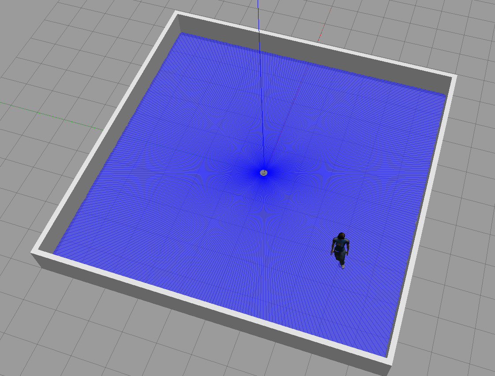
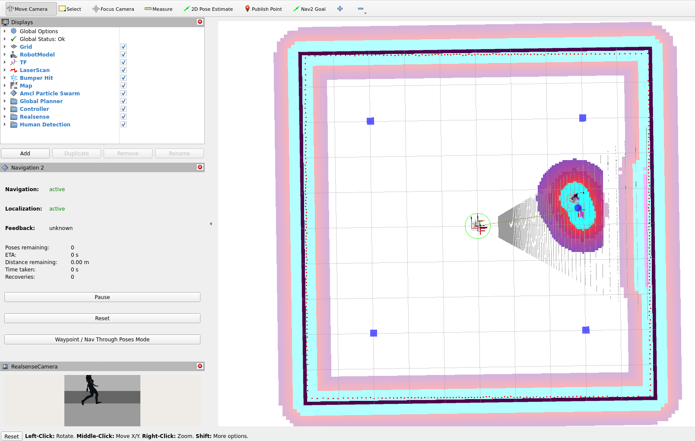

# ROS2 Workspace
Workspace for projects from [MARS Lab](https://sfumars.com/)
- Originally fork of https://github.com/athackst/vscode_ros2_workspace/tree/humble-nvidia

## Information
- OS: Ubuntu 22.04 LTS 
- ROS2: Humble

## Setup
See [general instructions for using workspaces with docker](https://github.com/SFU-MARS/ros2_tutorial/wiki/Building-and-using-the-dev-container).

## Running the simulation
1. Launch human simulator: 
    - Settings are in `hunavis/params/hunavsim.yaml`
```bash
ros2 launch hunavis mars.launch.py
```


2. Launch nav2: 
    - Settings are in `hunavis/params/tb3_custom_sim.yaml`
```bash
ros2 launch hunavis tb3_custom_sim_launch.py
```

3. Launch human detection (including loading rviz)
```bash
ros2 launch hunavis hudet.launch.py
```


#### Known issues
- If the simulator doesn't run properly, killing all processes that still are running after `^C` may help. 
- `gzserver` may be running in the background after `^C`, but can be killed using `pkill -9 gzserver`.
  - Similarly, killing `gzclient`, `ros`, `python3` or any other related processes may help